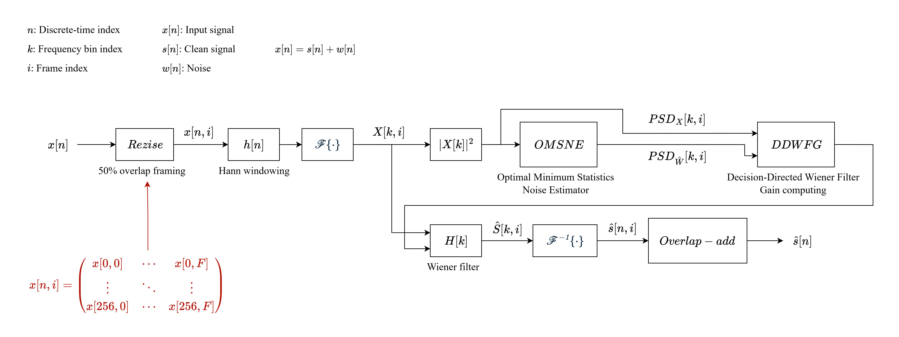
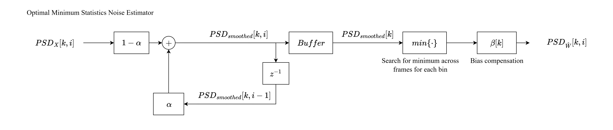
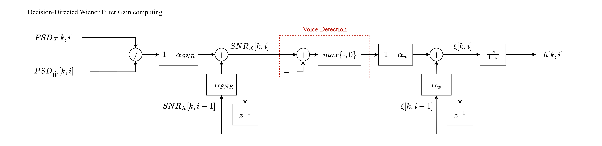
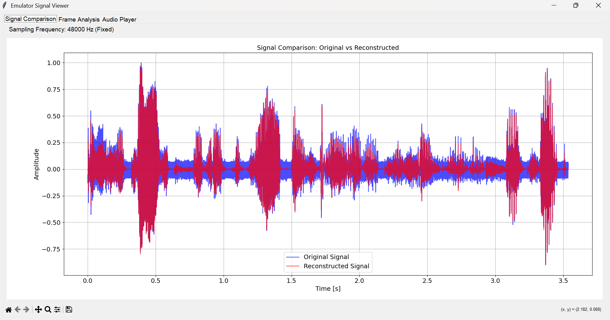
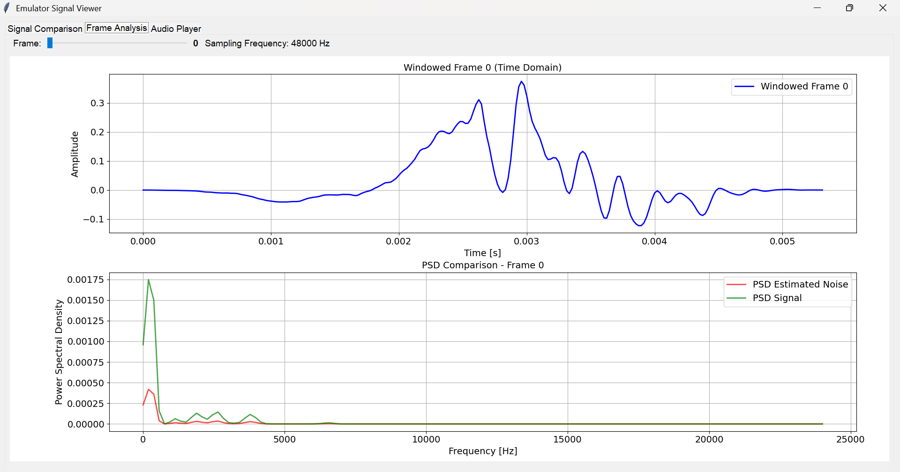
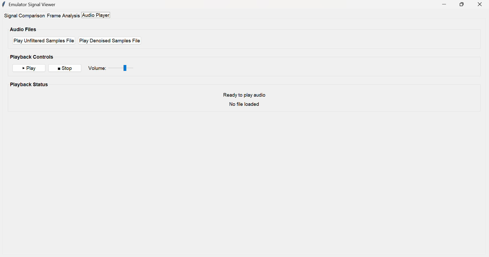

# Noise Adaptive Filter Emulation

## Description
This project implements an emulation of a low-energy stationary noise estimator and adaptive Decision-Directed Wiener filter for denoising audio samples.
The core processing is performed by a C++ script. The results are written into .txt files, which are read by the main interface programmed in Python. There is an additional python script executed at the beginning of the processing with the purpose of generating a .txt binary coded file from a .wav file.

##  About the C++ Processing
Starting from a single vector of samples obtained from the mentioned initial .txt file, the signal is segmented into frames with an overlap of 50%. 
Afterwards, a Hanning window is applied, which is followed by a 256-point FFT. Now in the frequency domain, the PSD of the spectrum for each frame is obtained. The PSD is used for obtaining an estimated PSD profile of the noise, which is later used for calculating the coefficients of an adaptive Decision-Directed Wiener filter.
Once filtered, the signal is inverse-transformed and an overlap-add is performed for reconstructing the time-domain final result.
In every key stage, .txt files are generated which are used by the main Python script to properly display the results.
The estimation algorithm is based in Martin's 2001 "Noise Power Spectral Density Estimation Based on Optimal Smoothing and Minimum Statistics".
The filtering technique is inspired in Ephraim and Malah's 1985 "Speech enhancement using a minimum-mean square error short-time spectral amplitude estimator".

<div style="text-align: center;">
  
  <p><em>Figure 1: Block diagram of the filter.</em></p>
</div>

<div style="text-align: center;">
  
  <p><em>Figure 2: Block diagram of the Noise Estimator.</em></p>
</div>

<div style="text-align: center;">
  
  <p><em>Figure 3: Block diagram of the adaptive Wiener filter coefficients calculation.</em></p>
</div>

## The Python GUI

<div style="text-align: center;">
  
  <p><em>Figure 4: Signal Comparison tab. In blue the original inputed signal. In red the filtered outputed signal.</em></p>
</div>

<div style="text-align: center;">
  
  <p><em>Figure 5: Frame Analysis tab. Time-domain windowed signal and frequency-domain full PSD and estimated PSD of the noise.</em></p>
</div>

<div style="text-align: center;">
  
  <p><em>Figure 6: Audio Player tab. Reproduce the original inputed audio file and the filtered audio file.</em></p>
</div>

## Directory Structure
```
emulation/
├── include/ # Libraries for FFT implementation, matplots, file interfacing and audio processing classes and functions
├── python/ # Frontend files       
├── src/    # Backend processing source files
```

## Key Files
- **Include**:
  - `audio_processing.hpp` : Declaration of classes and member functions for noise estimation and adaptive filtering.
  - `fileio.hpp` : Declaration of file writing and reading functions for file interfacing.
  - `frame.hpp` : Declaration of class and member function for signal windowing.
  - `matplotlibcpp.h` : Imports matplotlib.
  - `pocketfft_hdronly.h` : Imports pocketfft for FFT implementations like R2C and C2R.
- **Python**:
  - `emulator_GUI.py` : Reads files containing the results obtained from the cpp processing and displays them properly. Allows audio files reproduction.
  - `load_file.py` : Implements the necessary methods to read the files generated by the cpp processing.
  - `quant_tool.py` : Contains methods for fixed point quantizing / quantization.
  - `samples.py` : Implements a .wav to .txt converter.
- **Source (src)**:
  - `audio_processing.cpp` : Definition of classes and member functions for noise estimation and adaptive filtering.
  - `fileio.cpp` : Definition of file writing and reading functions for file interfacing.
  - `frame.cpp` : Definition of class and member function for signal windowing.
  - `main.cpp` : Main file.

# How to run
## Option 1:
- In a Git Bash terminal, navigate to the directory `adaptive_audio_filter_emulator` using `cd`
- Give permission to the the shell file `run_build.sh` using `chmod +x run_build.sh`
- Install pygame using `pip install pygame`
- Run the shell file: `./run_build.sh`
## Option 2:
- Navigate to the directory `adaptive_audio_filtering_SV/emulation` using `cd`
- Then execute the next commands in order to build and run the simulator:
  - `python python/samples.py`
  - `rm -r build`
  - `rm -r out`
  - `cmake -S . -B build -G "MinGW Makefiles"`
  - `cmake --build build`
  - `./build/out/AudioFilterSim.exe`
  - `python python/emulator_GUI.py`
